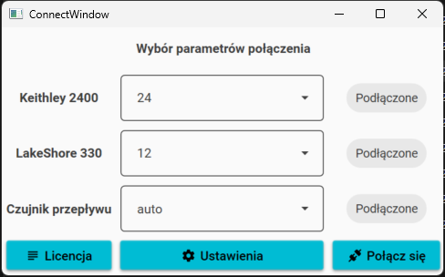
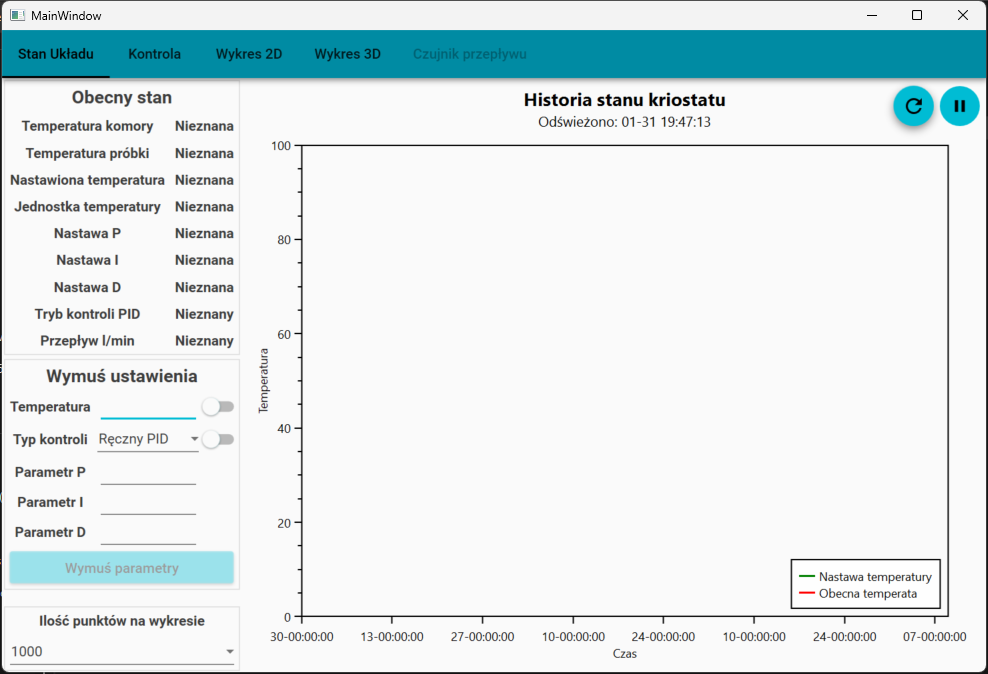
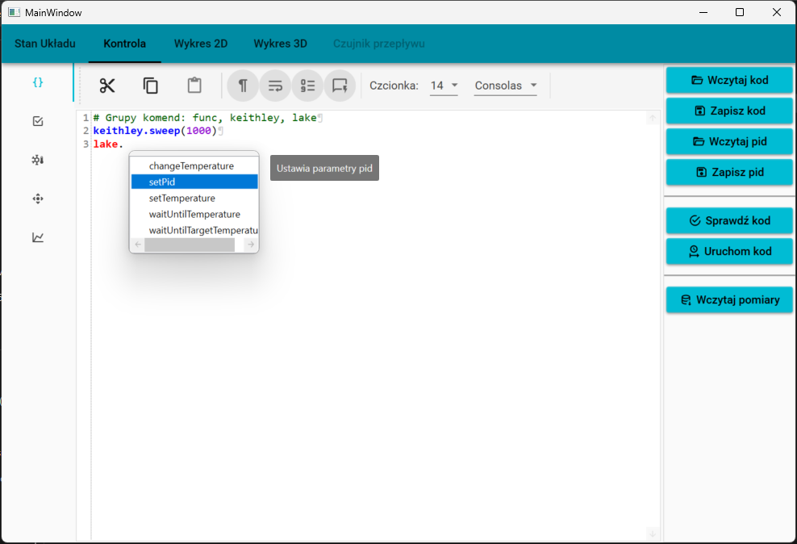
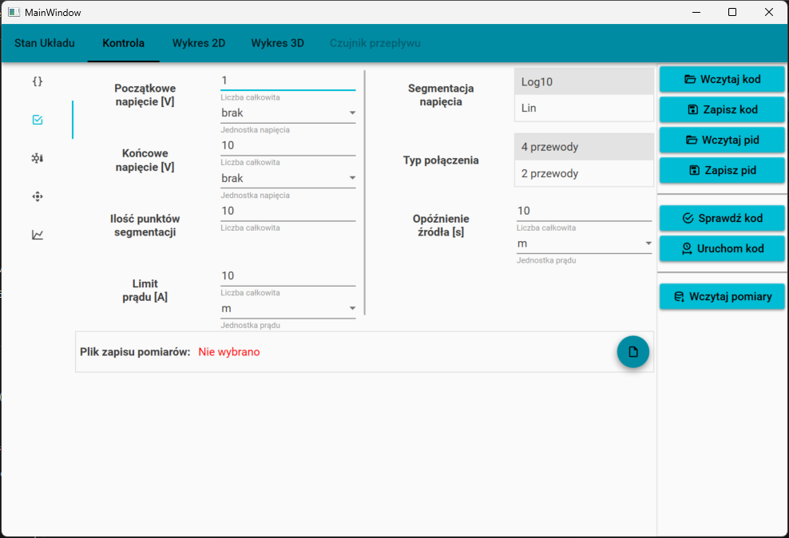
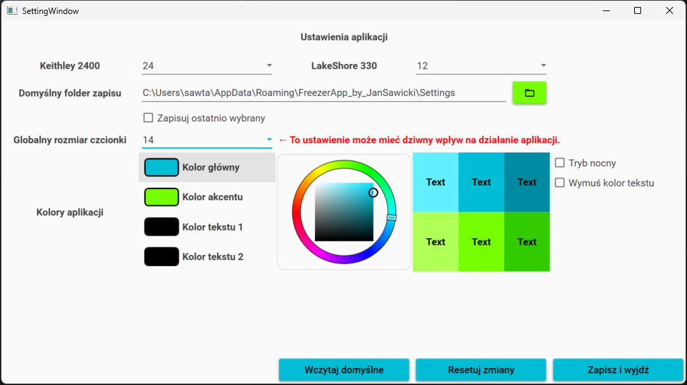

# Helium Cryostat Control

**Author:** Jan Sawicki  

All code in this repository is shared under the license specified in the `LICENSE.txt` file.

This repository contains the source code of an application used to control a helium cryostat and perform measurements.  
It represents an example of my work and is part of my **Master’s thesis (2023)**.

The shared code is mostly fully functional. Only DLLs responsible for controlling external GPIB hardware have been removed, as their dependencies licenses may not allow redistribution to third parties.

## Screenshots

Below are screenshots of the application in an idle state (no measurements running and no data loaded):

